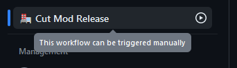

# OpenGOAL Mod Distribution Tools

**This is still being actively developed and may change, use at your own risk**

This repo contains some github actions, scripts, and JSON schemas to attempt to simplify and standardize OpenGOAL mod formats.

Note that overtime this action may change as the underlying expected structure of mods change.  One of the benefits of using these actions is that complying with said changes should be as easy as using the latest version.

## Usage

### Mod Bundling

The most basic usage involves using the binaries provided by `open-goal/jak-project` and adding a Github Actions workflow like so:

```yaml
name: 🏭 Cut Mod Release

on:
  workflow_dispatch:
    inputs:
      bump:
        description: 'Semver Bump Type'
        required: true
        default: 'patch'
        type: choice
        options:
          - patch
          - minor
          - major

permissions:
  contents: write

jobs:
  cut_release:
    name: "Cut Release"
    uses: open-goal/mod-bundling-tools/.github/workflows/mod-bundler.yml@v1
    with:
      semverBump: ${{ inputs.bump }}
      metadataName: "NAME"
      metadataDescription: "DESCRIPTION"
      metadataSupportedGames: "jak1,jak2"
      metadataAuthors: "authorName1,authorName2"
      metadataTags: "rng,gameplay-mod"
      metadataWebsiteUrl: "https://www.example.com/please/change/me"
    secrets:
      token: ${{ secrets.GITHUB_TOKEN }}
```
> You could add this to `.github/workflows/cut-release.yml` For example

You should then have a new workflow call `Cut Mod Release` on your repository's `Actions` tab:



And after clicking into it, you can trigger a release:


TODO - documentation on how to use custom binaries

